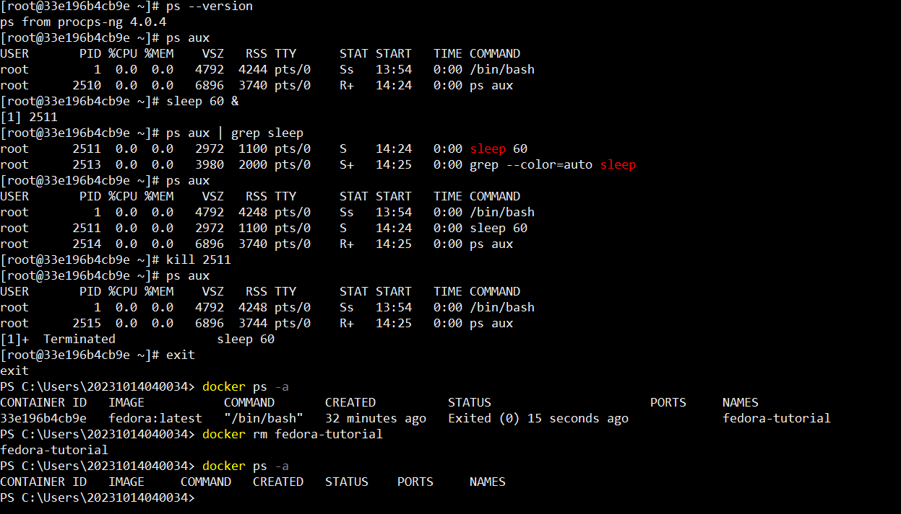

# 2025-1-atividade-02-docker-linux-introducao

**Nome:** Wagner Alves de Souza  
**Data:** 09/05/2025

---

## Introdução

Neste exercício, o objetivo foi compreender e aplicar, na prática, os conceitos abordados em aula, por meio da manipulação de permissões, gerenciamento de diretórios e pacotes, encerramento de processos e navegação no sistema de arquivos Linux.
  
  

## Relato

### Conferindo o Docker.

Conferi se o Docker estava instalado na minha máquina com o comando:  
`bash docker --version` -> Versão do Docker.
  
  

---

### Baixando imagem do Fedora, executando o container em modo interativo e definindo um nome personalizado.

`run` -> Baixa a imagem, caso ainda não exista localmente, e executa o container.  
`-it` -> Abre o container em modo interativo (com terminal conectado).  
`--name` -> Define um nome personalizado para o container (fedora-tutorial, no exemplo acima).
  
  

---

### Executando alguns comandos no terminal Bash.

  

Utilizei comandos do terminal para identificar o diretório atual, verificar o usuário logado, navegar até o diretório home e criar uma nova pasta.  

`pwd` -> Mostra o diretório de trabalho atual.  
`whoami` -> Exibe o nome do usuário atualmente logado.  
`cd ~` -> Navega para o diretório home do usuário.  
`ls -la` -> Lista todos os arquivos e diretórios, incluindo os ocultos, com detalhes como permissões, data, e tamanho.  
`mkdir [nome_do_diretório]` -> Cria um novo diretório.
  
  
---

### Navegando entre os diretórios.
  

  
  
Naveguei entre os diretórios e criei um arquivo texto no diretório Home.
  
  
`touch [nome_arquivo]` -> Cria um arquivo vazio.
  
  

---

### Renomeando arquivos, criando diretórios e movendo arquivos.

  
  
Utilizei o comando `mv` para renomear um arquivo, já que não informei um diretório como destino.

>No Linux, quando usamos mv apenas alterando o nome do arquivo e mantendo-o no mesmo local, o comando funciona como um renomeador.

Em seguida, naveguei até o diretório atividades, localizado no meu diretório home, criei um subdiretório chamado backup, e copiei o arquivo renomeado para dentro desse novo diretório.
Nesse processo, utilizei tanto o caminho absoluto quanto o caminho relativo.

`mv arquivo_original.txt novo_nome.txt` -> Renomeia o arquivo.  
`cd ~/atividades` -> Entra no diretório 'atividades'.  
`mkdir backup` -> Cria o subdiretório 'backup'.  
`cp ~/documento.txt backup/` -> Utilizei um caminho absoluto como origem (~/documento.txt) e um caminho relativo como destino (backup/) para copiar o arquivo renomeado.  
  
  
---

  
  
### Navegando e removendo arquivos.

  
  
  
Voltei para o diretório home, conferi o diretório de trabalho atual, listei os arquivos e removi o arquivo `documento.txt` do home.
Em seguida, acessei a pasta `backup` (que havia sido criada anteriormente) para verificar se a cópia do `documento.txt` ainda estava lá, já que havia feito uma duplicação do arquivo para esse local anteriormente.  
  
`cd ~` -> Volta para o diretório home.  
`pwd` -> Mostra o diretório atual.  
`ls` -> Lista os arquivos.  
`rm documento.txt` -> Remove o arquivo original.  
`cd ./atividades/backup` -> Entra na pasta de backup.  
`ls` -> Verifica se a cópia do arquivo está lá.  
  
---
  
  

### Atualizando pacotes.

Atualizei os pacotes do sistema utilizando o comando `dnf update`, acompanhado do parâmetro `-y`, que serve para confirmar automaticamente todas as solicitações do processo, evitando a necessidade de digitar "yes" manualmente durante a execução.  
  
`dnf update` -> Atualiza os pacotes do sistema.  
  
  
---
  
  
### Instalando e removendo o Nano.

  
  
Instalei o nano com o `dnf install nano -y` e removi em seguida com o `dnf remove nano -y`  
  
`dnf install` -> Instala pacotes.  
`dnf remove` -> Remove pacotes.  
  
  

---
  
  

### Instalando ps e mudando permissões de arquivos.

  
  
Criei o arquivo `script.sh` no diretório Home e alterei suas permissões para torná-lo executável pelo usuário proprietário e instalei o utilitário `ps`, que permite listar os processos em execução no sistema.  
  
`chmod u+x [nome_do_arquivo]` -> Dá permissão de execução ao dono.  
`dnf install [pacote]` -> Instala um pacote no sistema.  

---
  
  

### Utilizando ps, matando processos e removendo a imagem do fedora.

  
  
Verifiquei se o `ps` estava instalado corretamente consultando sua versão. Em seguida, utilizei o comando `ps aux` para listar todos os processos em execução no sistema. Para testar a execução em background, executei `sleep 60 &`, que inicia um processo que aguarda 60 segundos sem bloquear o terminal.  
Combinei o `ps aux` com o operador pipe `|` e o comando `grep sleep` para filtrar e visualizar apenas o processo relacionado ao `sleep`. Após localizá-lo, finalizei esse processo utilizando o comando `kill`.  
Depois disso, saí do terminal com o comando `exit`, listei todos os containers Docker com `docker ps -a`, e por fim, removi um container específico com `docker rm [nome_do_container]`.  
  
  
`ps --version` -> Verifica se o utilitário `ps` está instalado, exibindo sua versão atual.  
`ps aux` -> Lista todos os processos em execução no sistema com detalhes completos.  
`sleep 60 &` -> Inicia um processo que aguarda 60 segundos em segundo plano.  
`|` -> Encaminha a saída de um comando como entrada para outro.  
`grep sleep` -> Filtra a saída para exibir apenas as linhas que contêm "sleep".  
`kill [PID]` -> Finaliza o processo identificado pelo PID (Process ID).  
`exit` -> Encerra a sessão atual do terminal.  
`docker ps -a` -> Lista todos os containers Docker (ativos e inativos).  
`docker rm [nome_do_container]` -> Remove um container Docker pelo nome ou ID.  

---  

## Conclusão

Com esta atividade, aprendi a manipular diversos aspectos do ambiente Linux, como criar arquivos, instalar e remover pacotes, navegar entre diretórios, utilizar caminhos relativos e absolutos, encerrar processos e aplicar comandos para inspeção de processos do sistema. Também exercitei a escrita de documentação no formato Markdown, o que contribui para uma apresentação mais clara e organizada das ações realizadas.

**Dificuldades encontradas:**  
  
- A atividade em si é simples, especialmente com o apoio do professor e os tutoriais fornecidos, mas requer atenção aos detalhes e pode ser um pouco trabalhosa.
- Descobri que o editor `nano` não vem instalado por padrão na distribuição Fedora, ao contrário de algumas outras distros.
- Criar um documento `Markdown` minimamente agradável visualmente pode ser mais desafiador do que parece, exigindo atenção à formatação e clareza.  
  
### Comandos utilizados:  
  
<!-- `pwd` -> Mostra o diretório de trabalho atual.  
`whoami` -> Exibe o nome do usuário atualmente logado.  
`cd ~` -> Navega para o diretório home do usuário.  
`ls -la` -> Lista todos os arquivos e diretórios, incluindo os ocultos, com detalhes como permissões, data, e tamanho.  
`mkdir [nome_do_diretório]` -> Cria um novo diretório.  
`touch [nome_arquivo]` -> Cria um arquivo vazio.  
`mv arquivo_original.txt novo_nome.txt` -> Renomeia o arquivo.  
`cd ~/atividades` -> Entra no diretório 'atividades'.  
`mkdir backup` -> Cria o subdiretório 'backup'.  
`cp ~/documento.txt backup/` -> Utilizei um caminho absoluto como origem (~/documento.txt) e um caminho relativo como destino (backup/) para copiar o arquivo renomeado.  
`cd ~` -> Volta para o diretório home.  
`pwd` -> Mostra o diretório atual.  
`ls` -> Lista os arquivos.  
`rm documento.txt` -> Remove o arquivo original.  
`cd ./atividades/backup` -> Entra na pasta de backup.  
`ls` -> Verifica se a cópia do arquivo está lá.  
`dnf update` -> Atualiza os pacotes do sistema.  
`dnf install` -> Instala pacotes.  
`dnf remove` -> Remove pacotes.  
`chmod u+x [nome_do_arquivo]` -> Dá permissão de execução ao dono.  
`dnf install [pacote]` -> Instala um pacote no sistema.  
`ps --version` -> Verifica se o utilitário `ps` está instalado, exibindo sua versão atual.  
`ps aux` -> Lista todos os processos em execução no sistema com detalhes completos.  
`sleep 60 &` -> Inicia um processo que aguarda 60 segundos em segundo plano.  
`|` -> Encaminha a saída de um comando como entrada para outro.  
`grep sleep` -> Filtra a saída para exibir apenas as linhas que contêm "sleep".  
`kill [PID]` -> Finaliza o processo identificado pelo PID (Process ID).  
`exit` -> Encerra a sessão atual do terminal.  
`docker ps -a` -> Lista todos os containers Docker (ativos e inativos).  
`docker rm [nome_do_container]` -> Remove um container Docker pelo nome ou ID.   -->

### 🧭 Navegação e gerenciamento de diretórios

| Comando                          | Descrição                                                                 |
|----------------------------------|---------------------------------------------------------------------------|
| `pwd`                            | Mostra o diretório de trabalho atual.                                     |
| `cd ~`                           | Vai para o diretório home do usuário.                                     |
| `cd ~/atividades`               | Entra no diretório `atividades` dentro da home.                          |
| `cd ./atividades/backup`        | Entra na subpasta `backup`, a partir do diretório atual.                  |
| `ls`                             | Lista os arquivos e diretórios visíveis.                                  |
| `ls -la`                         | Lista todos os arquivos (inclusive ocultos) com detalhes.                 |
| `mkdir [nome_do_diretório]`     | Cria um novo diretório.                                                   |

---

### 📄 Gerenciamento de arquivos

| Comando                                            | Descrição                                                               |
|----------------------------------------------------|-------------------------------------------------------------------------|
| `touch [nome_arquivo]`                             | Cria um arquivo vazio.                                                  |
| `mv arquivo_original.txt novo_nome.txt`            | Renomeia ou move um arquivo.                                            |
| `cp ~/documento.txt backup/`                       | Copia um arquivo da home para o diretório `backup/`.                    |
| `rm documento.txt`                                 | Remove o arquivo `documento.txt`.                                       |

---

### 👤 Usuário e sessão

| Comando     | Descrição                                 |
|-------------|-------------------------------------------|
| `whoami`    | Exibe o nome do usuário atualmente logado.|
| `exit`      | Encerra a sessão atual do terminal.       |

---

### 🔐 Permissões

| Comando                              | Descrição                                              |
|--------------------------------------|--------------------------------------------------------|
| `chmod u+x [nome_do_arquivo]`        | Dá permissão de execução ao dono do arquivo.          |

---

### 📦 Gerenciamento de pacotes (DNF)

| Comando                        | Descrição                           |
|--------------------------------|-------------------------------------|
| `dnf update`                   | Atualiza os pacotes do sistema.     |
| `dnf install [pacote]`         | Instala um pacote no sistema.       |
| `dnf remove [pacote]`          | Remove um pacote do sistema.        |

---

### 🧠 Processos

| Comando              | Descrição                                                                 |
|----------------------|---------------------------------------------------------------------------|
| `ps --version`       | Verifica se o `ps` está instalado e exibe sua versão.                     |
| `ps aux`             | Lista todos os processos ativos com detalhes.                             |
| `sleep 60 &`         | Executa um processo em segundo plano que espera 60 segundos.              |
| `grep sleep`         | Filtra a saída para mostrar apenas linhas contendo “sleep”.               |
| `kill [PID]`         | Finaliza o processo pelo seu PID (Process ID).                            |
| `|`                  | Encaminha a saída de um comando como entrada para outro (pipe).           |

---

### 🐳 Docker

| Comando                          | Descrição                                               |
|----------------------------------|---------------------------------------------------------|
| `docker ps -a`                   | Lista todos os containers Docker (ativos e inativos).   |
| `docker rm [nome_do_container]` | Remove um container Docker pelo nome ou ID.             |
  
  
 
🧠 Participação Especial  

Parte do conteúdo, organização e revisão deste material contou com o apoio da ferramenta ChatGPT, utilizada para fins educacionais e de aprimoramento técnico.