# 2025-1-atividade-02-docker-linux-introducao

**Nome:** Wagner Alves de Souza  
**Data:** 09/05/2025

---

## Introdução

Neste exercício, o objetivo foi compreender e aplicar, na prática, os conceitos abordados em aula, por meio da manipulação de permissões, gerenciamento de diretórios e pacotes, encerramento de processos e navegação no sistema de arquivos Linux.
  
  

## Relato

### Conferindo o Docker.

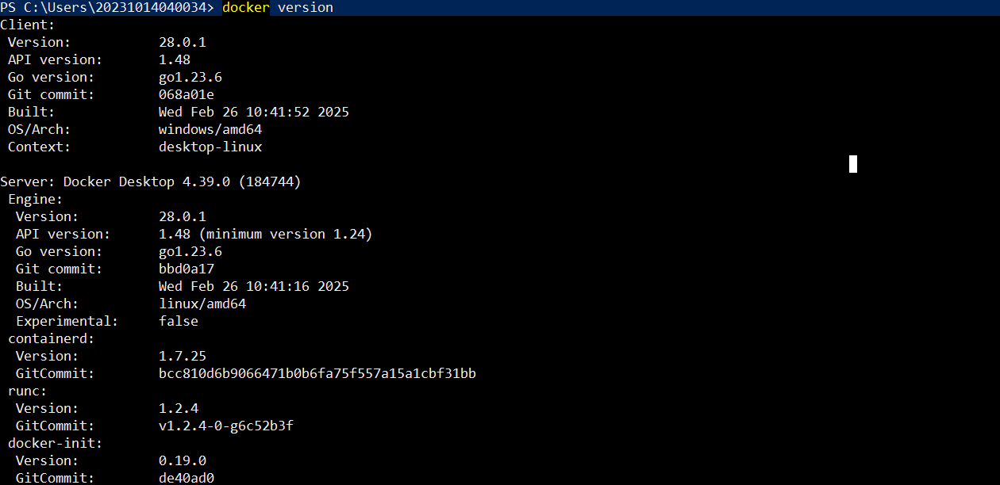

Conferi se o Docker estava instalado na minha máquina com o comando:  
`bash docker --version` -> Versão do Docker.
  
  

---

### Baixando imagem do Fedora, executando o container em modo interativo e definindo um nome personalizado.

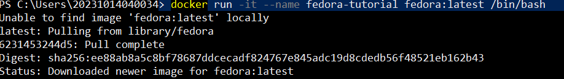

`run` -> Baixa a imagem, caso ainda não exista localmente, e executa o container.  
`-it` -> Abre o container em modo interativo (com terminal conectado).  
`--name` -> Define um nome personalizado para o container (fedora-tutorial, no exemplo acima).
  
  

---

### Executando alguns comando do Shell.

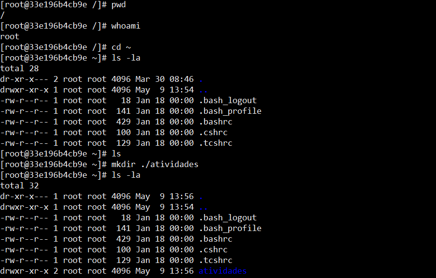  

Utilizei comandos do terminal para identificar o diretório atual, verificar o usuário logado, navegar até o diretório home e criar uma nova pasta.  

`pwd` -> Mostra o diretório de trabalho atual.  
`whoami` -> Exibe o nome do usuário atualmente logado.  
`cd ~` -> Navega para o diretório home do usuário.  
`ls -la` -> Lista todos os arquivos e diretórios, incluindo os ocultos, com detalhes como permissões, data, e tamanho.  
`mkdir [nome_do_diretório]` -> Cria um novo diretório.
  
  
---

### Navegando entre os diretórios.
  

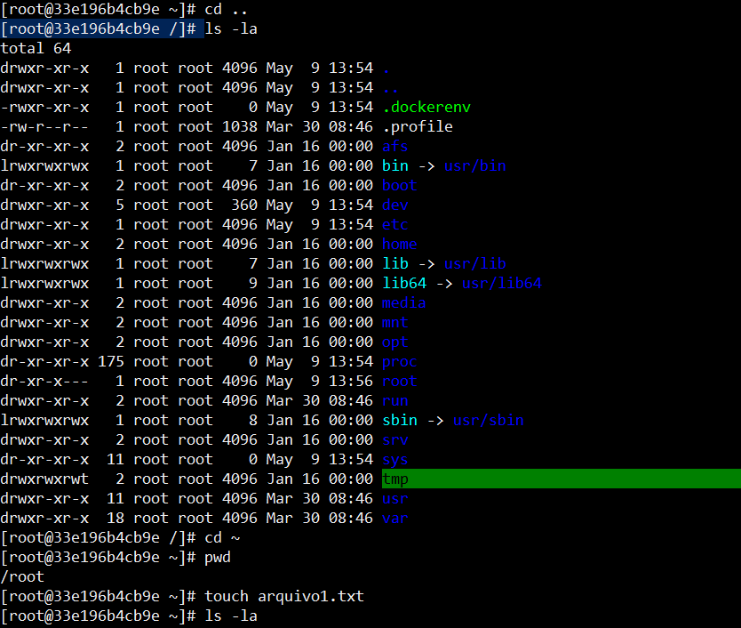
  
  
Naveguei entre os diretórios e criei um arquivo texto no diretório Home.
  
  
`touch [nome_arquivo]` -> Cria um arquivo vazio.
  
  

---

### Renomeando arquivos, criando diretórios e movendo arquivos.

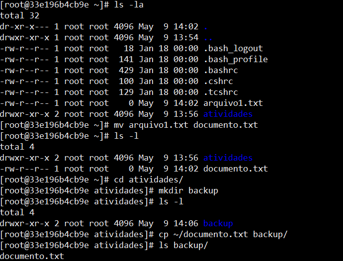
  
  
Utilizei o comando `mv` para renomear um arquivo, já que não informei um diretório como destino.

>No Linux, quando usamos mv apenas alterando o nome do arquivo e mantendo-o no mesmo local, o comando funciona como um renomeador.

Em seguida, naveguei até o diretório atividades, localizado no meu diretório home, criei um subdiretório chamado backup, e copiei o arquivo renomeado para dentro desse novo diretório.
Nesse processo, utilizei tanto o caminho absoluto quanto o caminho relativo.

`mv arquivo_original.txt novo_nome.txt` -> Renomeia o arquivo.  
`cd ~/atividades` -> Entra no diretório 'atividades'.  
`mkdir backup` -> Cria o subdiretório 'backup'.  
`cp ~/documento.txt backup/` -> Utilizei um caminho absoluto como origem (~/documento.txt) e um caminho relativo como destino (backup/) para copiar o arquivo renomeado.  
  
  
---

  
  
### Navegando e removendo arquivos.

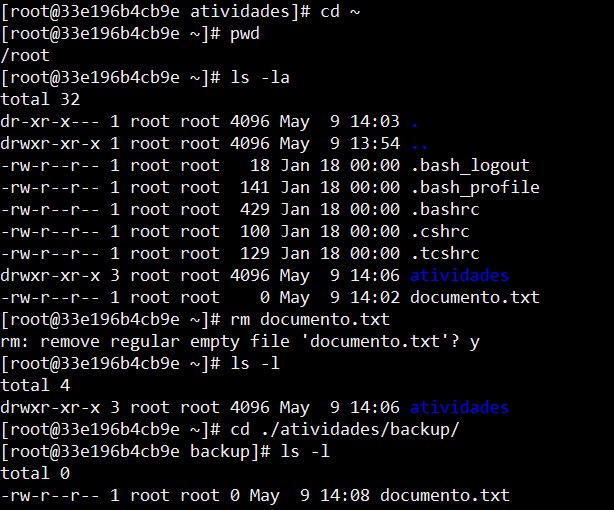  
  
  
Voltei para o diretório home, conferi o diretório de trabalho atual, listei os arquivos e removi o arquivo `documento.txt` do home.
Em seguida, acessei a pasta `backup` (que havia sido criada anteriormente) para verificar se a cópia do `documento.txt` ainda estava lá, já que havia feito uma duplicação do arquivo para esse local anteriormente.  
  
`cd ~` -> Volta para o diretório home.  
`pwd` -> Mostra o diretório atual.  
`ls` -> Lista os arquivos.  
`rm documento.txt` -> Remove o arquivo original.  
`cd ./atividades/backup` -> Entra na pasta de backup.  
`ls` -> Verifica se a cópia do arquivo está lá.  
  
---
  
  

### Atualizando pacotes.

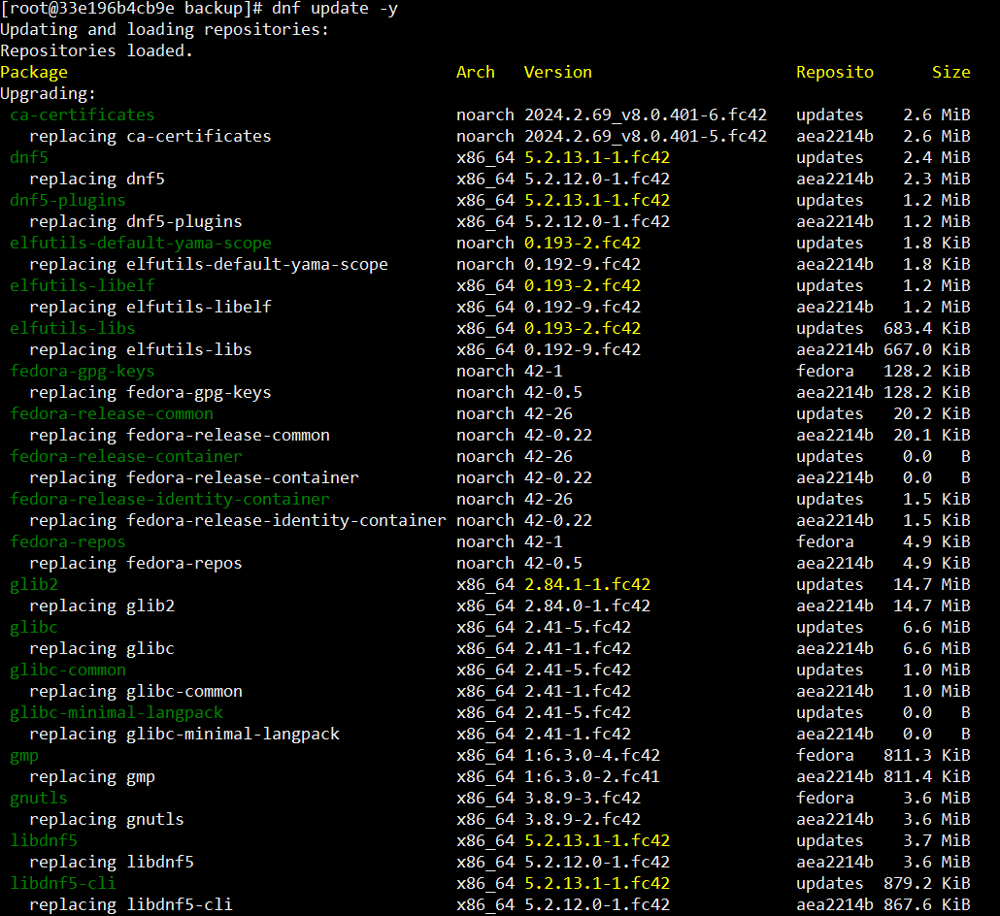
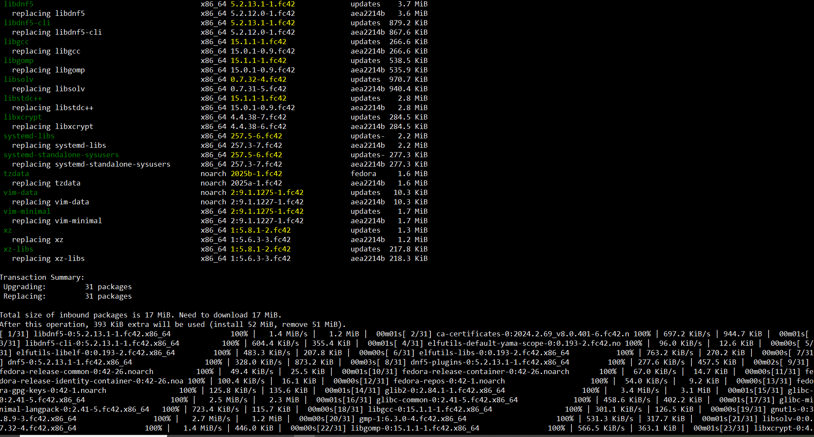
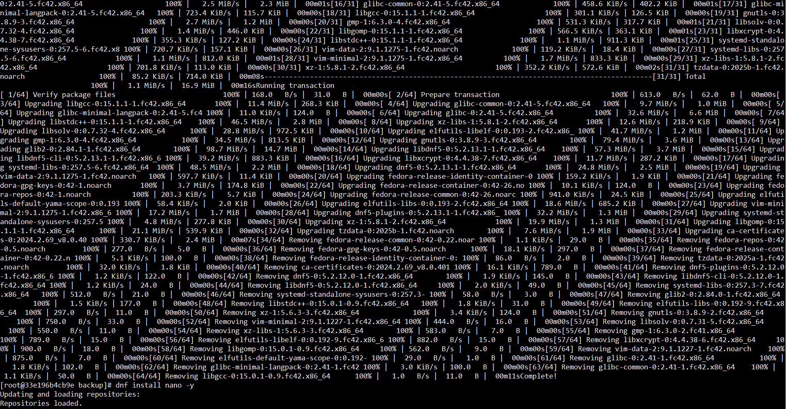

Atualizei os pacotes do sistema utilizando o comando `dnf update`, acompanhado do parâmetro `-y`, que serve para confirmar automaticamente todas as solicitações do processo, evitando a necessidade de digitar "yes" manualmente durante a execução.  
  
`dnf update` -> Atualiza os pacotes do sistema.  
  
  
---
  
  
### Instalando e removendo o Nano.

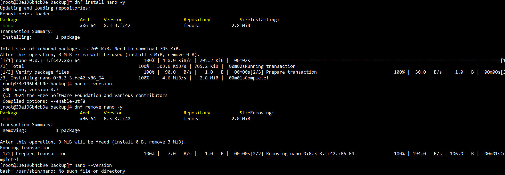  
  
Intalei o nano com o `dnf install nano -y` e removi em seguida com o `dnf remove nano -y`  
  
`dnf install` -> Instala pacotes.  
`dnf remove` -> Remove pacotes.  
  
  

---
  
  

###

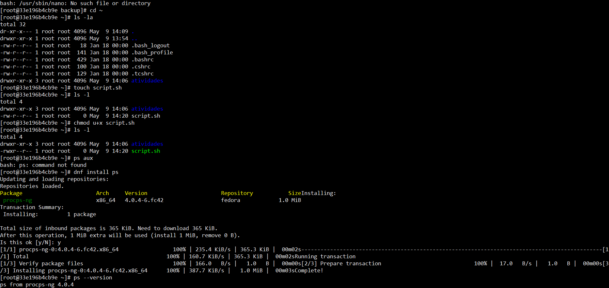

---
  
  

###

---
  
  

###

---

### Imagens:

  
*Figura 1 - Resultado da etapa X*

  
*Figura 2 - Resultado da etapa Y*

---

## Conclusão

Com esta atividade, aprendi:

- [Ponto aprendido 1]
- [Ponto aprendido 2]

**Dificuldades encontradas:**

- [Descreva as dificuldades ou desafios enfrentados]
